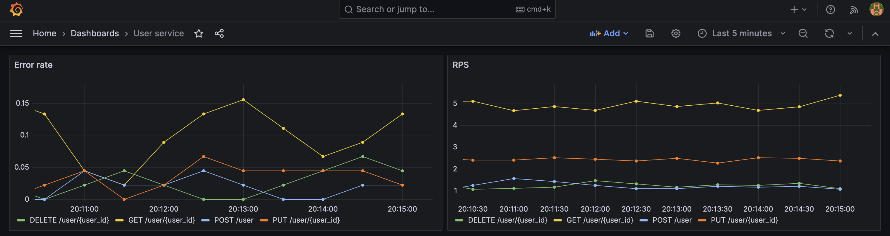
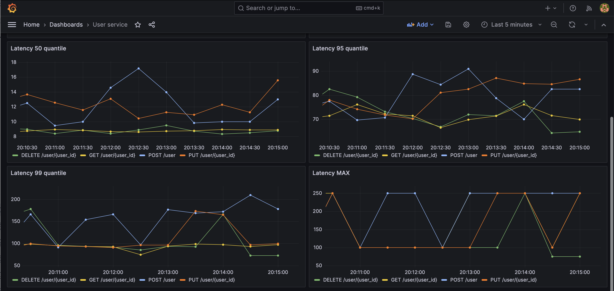
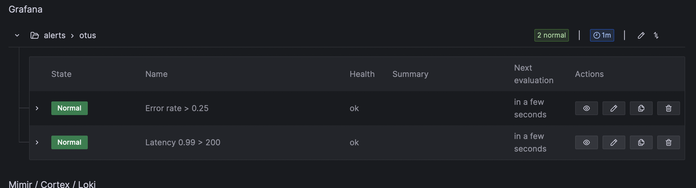

## Monitoring

### How to install

Install ingress

`kubectl create namespace m && helm repo add ingress-nginx https://kubernetes.github.io/ingress-nginx/ && helm repo update && helm install nginx ingress-nginx/ingress-nginx --namespace m -f nginx-ingress.yaml`

Install user-service 

`helm install user-service ./user-chart`

Install prometheus

`helm repo add prometheus-community https://prometheus-community.github.io/helm-charts`
`helm install prometheus prometheus-community/kube-prometheus-stack -f prometheus.yaml --atomic`

Configure ingress for exporting metrics

``
helm upgrade nginx ingress-nginx 
--repo https://kubernetes.github.io/ingress-nginx
--namespace m 
--set controller.metrics.enabled=true 
--set-string controller.podAnnotations."prometheus\.io/scrape"="true" 
--set-string controller.podAnnotations."prometheus\.io/port"="10254" 
--set controller.metrics.serviceMonitor.additionalLabels.release="prometheus"
``

### Dashboard examples

**User service dashboard**

* RPS
* Error rate

Latency:
* 0.5 quantile
* 0.95 quantile
* 0.99 quantile
* max 

**Nginx dashboard**

* RPS
* Error rate
* Memory Usage
* CPU Usage

Latency:
* 0.5 quantile
* 0.95 quantile
* 0.99 quantile
* max 

--- 

**Alerts**

